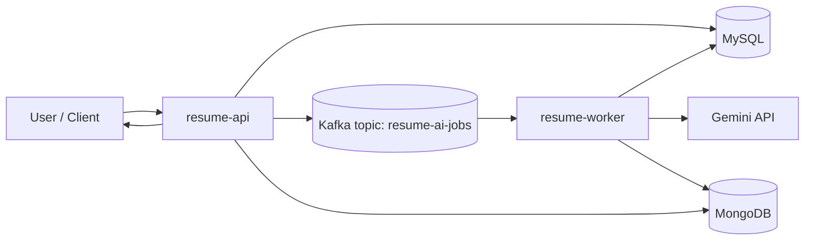

# Resume Feedback Platform

Enterprise-grade platform for resume management, secure sharing, versioned feedback, and AI-assisted analysis.

This repository is a multi-module Spring Boot monorepo with:
- `resume-api`: synchronous REST API for auth, resumes, share links, comments, and AI job orchestration.
- `resume-worker`: asynchronous worker that consumes Kafka jobs and generates AI feedback.
- `common`: shared contracts and cross-module models (including Kafka payloads).

## Quick Start

### 1) Prerequisites
- Java 17
- Maven Wrapper (`mvnw` / `mvnw.cmd`)
- MySQL
- MongoDB
- Kafka
- Redis (for rate-limit features)

### 2) Build all modules
```bash
./mvnw -DskipTests package
```

### 3) Run API
```bash
./mvnw -pl resume-api spring-boot:run
```

### 4) Run worker
```bash
./mvnw -pl resume-worker spring-boot:run
```

### 5) Validate
- Login: `POST /api/auth/login`
- Upload resume: `POST /api/resumes` (multipart: `file`, `title`)
- Check latest AI job: `GET /api/resumes/{resumeId}/versions/{versionId}/ai-jobs/latest`

---

## Business Context and Scope

### Executive Summary
The platform allows users to upload and version resumes, share them through controlled links, receive comments, and generate AI feedback asynchronously.  
It separates user-facing API latency from AI processing latency by moving feedback generation to a Kafka-based worker pipeline.

### Problem It Solves
- Resume review is usually manual and inconsistent.
- Sharing and auditing resume access is often insecure or not traceable.
- AI processing can be slow and should not block upload flows.

### In Scope
- User registration/login (JWT)
- Resume upload, listing, download, and versioning
- Secure share links with audit trail
- Owner/public comments
- Asynchronous AI job creation and status tracking
- AI feedback persistence and retrieval

### Out of Scope (Current)
- Multi-tenant organization model
- Real-time WebSocket notifications for job completion
- Advanced prompt management UI
- Full SLO dashboards as code

### Target Users
- Resume owners (candidates/professionals)
- Recruiters/managers reviewing shared resumes
- Platform operators/developers

---

## Core Functional Capabilities

### Main Capabilities
- `Auth`: register and login with JWT
- `Resume`: create, version, download, and list resumes
- `Share`: issue and revoke secure share links
- `Comments`: owner and token-based public comments
- `AI`: create jobs, poll status, regenerate, and fetch feedback

### Main Happy Path
1. User authenticates and uploads resume.
2. API stores metadata and file, creates `PENDING` AI job, and publishes Kafka event.
3. Worker consumes event, processes feedback with Gemini, stores result, updates job status.
4. API returns latest job status and feedback when available.

### Important Alternative/Error Flows
- Duplicate/idempotent AI job creation returns existing job.
- Worker retries failed jobs with backoff (up to configured max attempts).
- If AI provider is unavailable, job moves to `FAILED` and records error details.

---

## Non-Functional Requirements

### Performance
- API endpoints remain responsive by offloading AI processing to worker/Kafka.
- Upload/request path should not depend on LLM response time.

### Scalability
- API and worker are stateless at service level and can scale horizontally.
- Kafka partitions allow parallel AI job consumption.

### Availability and Reliability
- Decoupled API/worker architecture improves resilience.
- Retry scheduler for failed jobs with configurable backoff.

### Data Consistency
- Relational data in MySQL (transactional consistency for core entities).
- Event-driven eventual consistency between job creation and feedback availability.

### Security
- JWT authentication for protected API routes.
- Tokenized public share links with controlled permissions.
- Security and Kafka TLS settings via environment variables.

### Observability
- Structured logs from API/worker.
- Actuator health endpoints.
- Error details stored at AI job level (`errorCode`, `errorDetail`).

### Maintainability and Extensibility
- Multi-module separation by responsibility.
- Shared contracts in `common`.
- Clear boundaries between synchronous API logic and asynchronous processing.

---

## Architecture

### Architectural Style
- Layered modular monolith at repository level
- Event-driven asynchronous processing for AI pipeline

### High-Level Components
- `resume-api`
  - Auth, resume, sharing, comments, AI job orchestration
  - Publishes `AiJobRequestedMessage` to Kafka
- `resume-worker`
  - Consumes AI jobs, calls Gemini, stores feedback, updates job status
- `common`
  - Shared message contracts and models
- Datastores
  - MySQL: users, resumes, versions, jobs, audit, refs
  - MongoDB: AI feedback documents
  - Redis: rate-limit support
  - Kafka: AI jobs topic

### Data Flow


### Integration Strategy
- REST for user-facing operations
- Kafka messaging for asynchronous AI jobs

### Persistence Strategy
- MySQL for transactional entities and job state
- MongoDB for AI feedback payloads

---

## Technical Decisions and Trade-offs

### Key Decisions
- Async AI processing via Kafka instead of synchronous API calls.
- Dual persistence: MySQL (core state) + MongoDB (feedback document model).
- JWT-based stateless auth for API endpoints.

### Trade-offs
- Pros: responsiveness, decoupling, better throughput under AI latency.
- Cons: eventual consistency and operational complexity (Kafka + worker).

### Known Limitations
- AI completion is not immediate; clients must poll.
- Health checks can reflect downstream dependency latency.

### Technical Risks
- Provider/API key misconfiguration may stall or fail jobs.
- Broker/auth settings can break event flow if environment drift occurs.

---

## Challenges and Lessons Learned

- Kafka SSL and deserializer compatibility required explicit environment handling.
- AI payload serialization required explicit Java Time support for `Instant`.
- Event publication timing needed post-commit publishing to avoid race conditions where worker reads before DB commit.

---

## Local Development and Operations

### Environment Variables (core)
| Variable | Required | Module | Notes |
|---|---|---|---|
| `SPRING_DATASOURCE_URL` | Yes | API/Worker | MySQL connection |
| `SPRING_DATASOURCE_USERNAME` | Yes | API/Worker | MySQL user |
| `SPRING_DATASOURCE_PASSWORD` | Yes | API/Worker | MySQL password |
| `SPRING_DATA_MONGODB_URI` | Yes | API/Worker | MongoDB URI |
| `SPRING_KAFKA_BOOTSTRAP_SERVERS` | Yes | API/Worker | Kafka brokers |
| `GEMINI_API_KEY` | Yes (for AI) | Worker | Gemini key |

### Tests
- Unit/integration tests exist per module.
- Run all tests:
```bash
./mvnw test
```
- Run module tests:
```bash
./mvnw -pl resume-api test
./mvnw -pl resume-worker test
./mvnw -pl common test
```

### Deployment
- Heroku deployment is configured from GitHub `main`.
- API and worker process types are defined through `Procfile`.

### Monitoring
- Use Heroku logs for API/worker diagnosis.
- Monitor AI job state transitions (`PENDING -> PROCESSING -> DONE/FAILED`).

---

## Roadmap

- Add push notifications/webhooks for AI job completion.
- Add richer observability (metrics dashboards and tracing).
- Improve retry/dead-letter strategy for poison events.
- Add admin UI for operational visibility and reprocessing.
- Expand AI provider abstraction and prompt version governance.

---

## Module READMEs
- [API Module](resume-api/README.md)
- [Worker Module](resume-worker/README.md)
- [Common Module](common/README.md)

