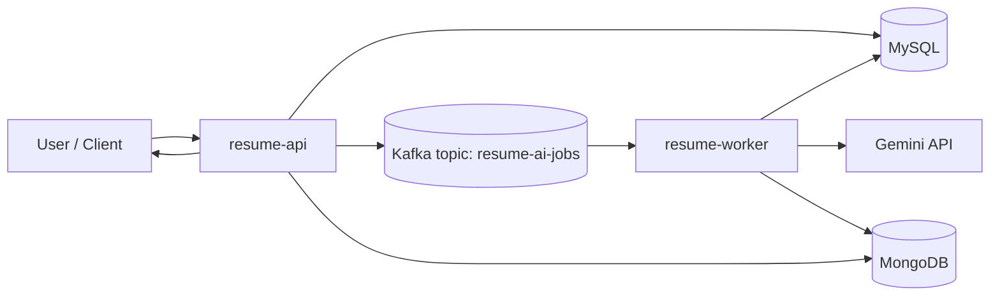

# Architecture

Related docs:
- [Requirements](requirements.md)
- [Operations](operations.md)
- [Root README](../README.md)

## Architectural Style

- Layered modular monolith at repository level
- Event-driven asynchronous processing for AI pipeline

## High-Level Components

- `resume-api`
  - Auth, resume, sharing, comments, AI job orchestration
  - Publishes `AiJobRequestedMessage` to Kafka
- `resume-worker`
  - Consumes AI jobs, calls Gemini, stores feedback, updates job status
- `common`
  - Shared message contracts and models
- Datastores
  - MySQL: users, resumes, versions, jobs, audit, refs
  - MongoDB: AI feedback documents
  - Redis: rate-limit support
  - Kafka: AI jobs topic

## Data Flow

## Integration Strategy

- REST for user-facing operations
- Kafka messaging for asynchronous AI jobs

## Persistence Strategy

- MySQL for transactional entities and job state
- MongoDB for AI feedback payloads

## Notes

- The API publishes AI events after transaction commit to avoid race conditions with worker consumption.
- AI job lifecycle is tracked in MySQL while feedback payloads are stored in MongoDB.
