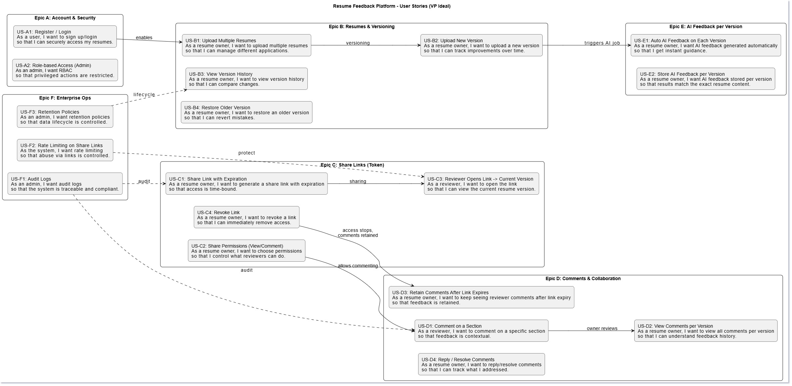
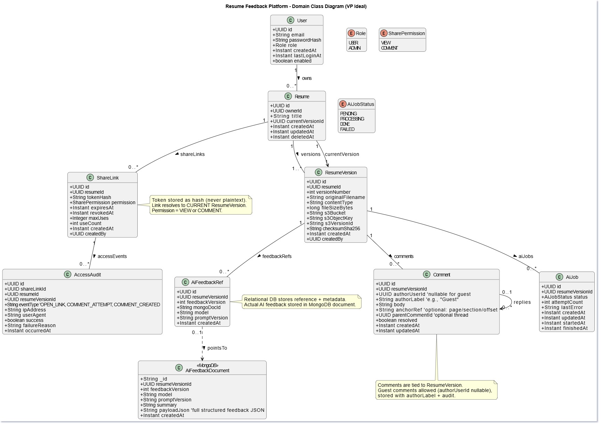
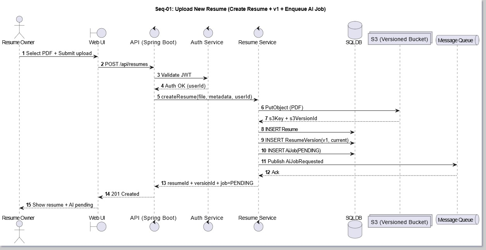
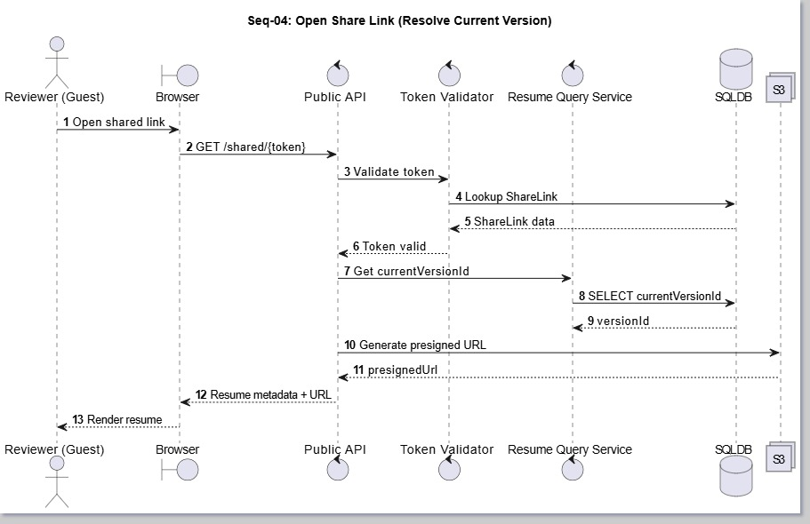
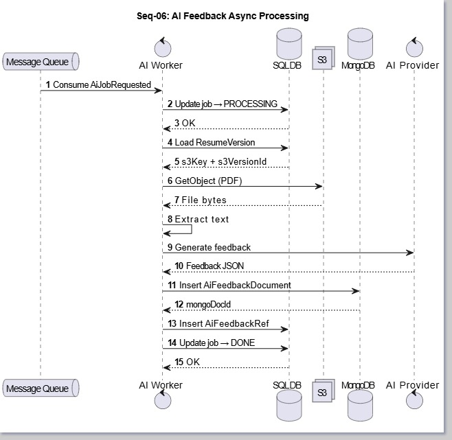
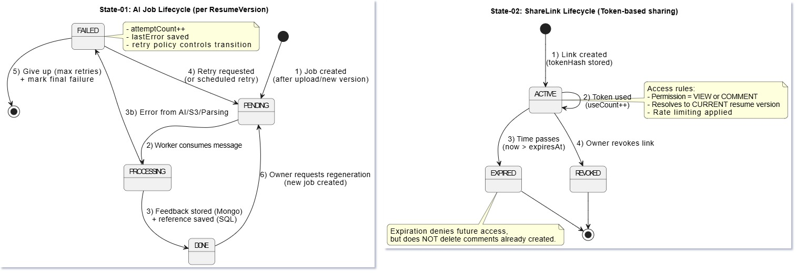

# resume-feedback-platform

### Use Case Diagram

This diagram captures the primary actors (resume owners and external reviewers) and the system boundaries, showing how authentication, resume management, and sharing flows map to user-facing capabilities and external access paths.

### User Stories

This view translates stakeholder needs into scoped stories, highlighting the backlog shape across registration, resume lifecycle, sharing, and feedback workflows that the platform must satisfy.

This view translates stakeholder needs into scoped stories, highlighting the backlog shape across registration, resume lifecycle, sharing, and feedback workflows that the platform must satisfy.

### Domain Class Model

The model outlines core entities (User, Resume, ResumeVersion, SharedLink, Comment, AIJob) and their relationships, clarifying ownership, versioning, and permission boundaries used throughout the service layer.

The model outlines core entities (User, Resume, ResumeVersion, SharedLink, Comment, AIJob) and their relationships, clarifying ownership, versioning, and permission boundaries used throughout the service layer.

## Sequence Diagrams

Sequence 01 traces the authenticated resume upload flow, emphasizing request validation, metadata persistence, version creation, and downstream AI job enqueueing.

Sequence 01 traces the authenticated resume upload flow, emphasizing request validation, metadata persistence, version creation, and downstream AI job enqueueing.

Sequence 02 details how a shareable link is created and stored, including token generation, permission scoping, and the response returned to the owner.

Sequence 02 details how a shareable link is created and stored, including token generation, permission scoping, and the response returned to the owner.

Sequence 03 models external access via a shared link, focusing on token validation, permission checks, and secure retrieval of the current resume version.

Sequence 03 models external access via a shared link, focusing on token validation, permission checks, and secure retrieval of the current resume version.

Sequence 04 covers the commenting flow, showing how viewer permissions are enforced and comments are persisted against a specific resume version.

Sequence 04 covers the commenting flow, showing how viewer permissions are enforced and comments are persisted against a specific resume version.

Sequence 05 follows the AI feedback pipeline, from job creation through asynchronous processing and storage of generated feedback.

Sequence 05 follows the AI feedback pipeline, from job creation through asynchronous processing and storage of generated feedback.

Sequence 06 illustrates resume version history access, including pagination of versions and retrieval of historical files for authorized owners.

Sequence 06 illustrates resume version history access, including pagination of versions and retrieval of historical files for authorized owners.

## Domain Behavior

The state diagrams summarize lifecycle transitions for resumes, shared links, and AI jobs, capturing terminal states and error paths needed for robust orchestration.

The state diagrams summarize lifecycle transitions for resumes, shared links, and AI jobs, capturing terminal states and error paths needed for robust orchestration.
