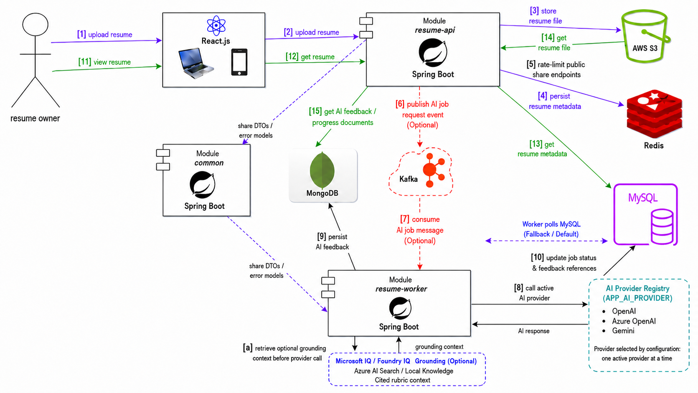
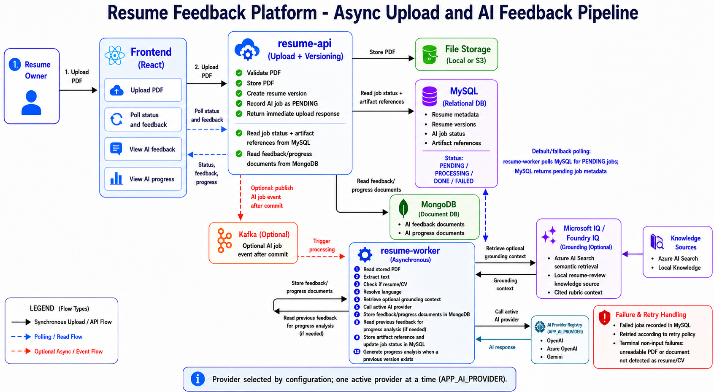
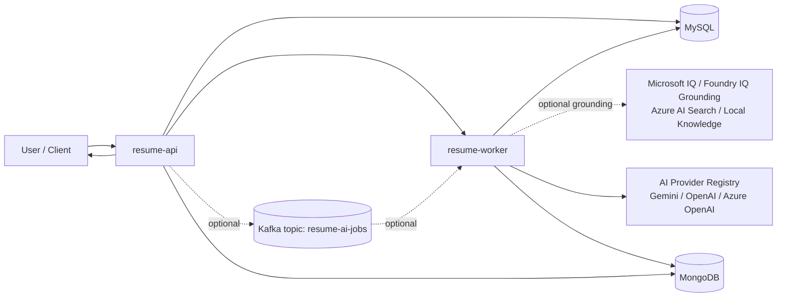
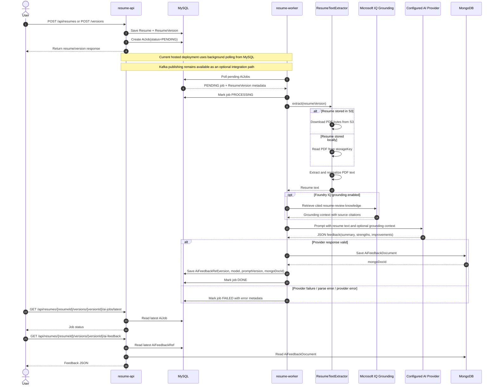
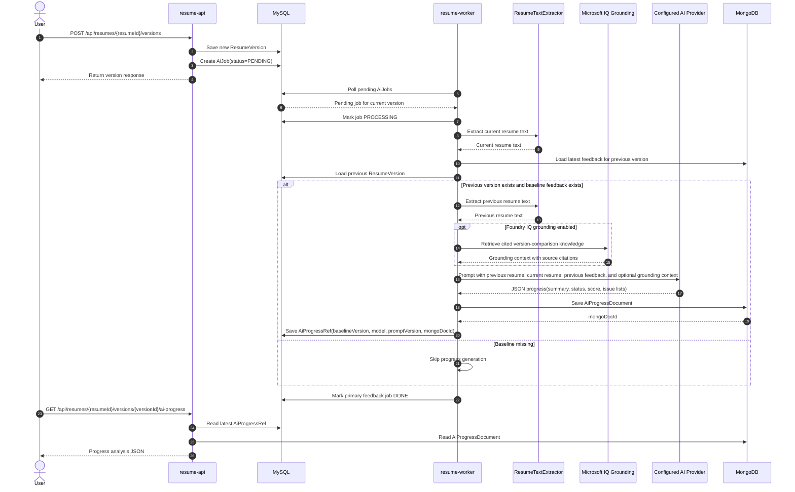

# Architecture

Related docs:
- [Requirements](requirements.md)
- [Operations](operations.md)
- [Root README](../README.md)

## Architectural Style

- Layered modular monolith at repository level
- Asynchronous worker processing for the AI pipeline, with optional event-driven Kafka support

## High-Level Components

- `resume-api`
  - Auth, resume, sharing, comments, AI job orchestration
  - Creates `AiJob` records and supports optional Kafka publishing
- `resume-worker`
  - Processes AI jobs, retrieves optional Microsoft IQ / Foundry IQ grounding context, calls the configured AI provider, stores feedback, updates job status
- `common`
  - Shared message contracts and models
- Datastores
  - MySQL: users, resumes, versions, jobs, audit, refs
  - MongoDB: AI feedback documents
  - Redis: optional rate-limit support
  - Kafka: optional AI jobs topic integration

## Data Flow

## AI Sequence Flows

### AI Resume Feedback Generation

### AI Progress Analysis Across Resume Versions

## Integration Strategy

- REST for user-facing operations
- Background worker for asynchronous AI jobs
- Optional Kafka integration for event-driven deployments
- Optional Microsoft IQ / Foundry IQ grounding via Azure AI Search semantic retrieval or local demo knowledge

## Persistence Strategy

- MySQL for transactional entities and job state
- MongoDB for AI feedback payloads

## Notes

- The API supports after-commit AI event publication when Kafka is enabled.
- AI job lifecycle is tracked in MySQL while feedback payloads are stored in MongoDB.
- The current hosted deployment uses the scheduled retry/polling path that processes `PENDING` jobs directly from MySQL.
